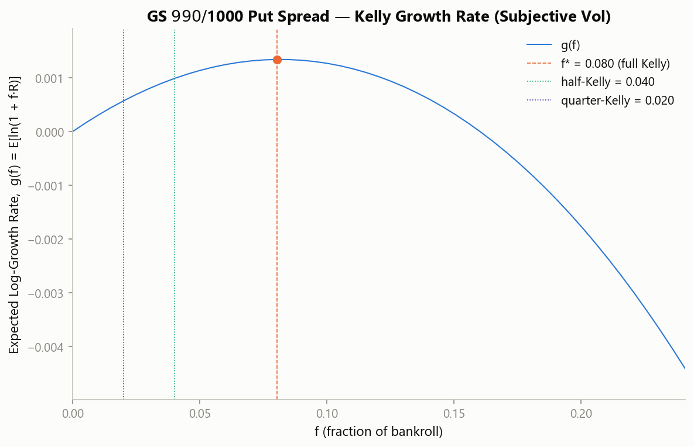

# Kelly Criterion Position Sizing for Credit Spreads

Numerical Kelly-criterion solver for vertical credit spreads, derived from first principles and applied to a live options position. Companion code to the paper **[Kelly Criterion Position Sizing](Kelly%20Criterion%20Position%20Sizing.pdf)**.

## Overview

The classical Kelly formula, `f* = p - q/b`, has a closed form because a binary bet has exactly two outcomes. A vertical credit spread doesn't: its P&L is piecewise-linear in the underlying's terminal price, with a capped gain, a capped loss, and a full continuum in between. That breaks the closed-form case, so sizing it correctly requires simulating the outcome distribution and solving numerically for the fraction of capital that maximizes long-run compound growth.

This repo is that solver: a Monte Carlo Kelly optimizer built specifically for short (credit) vertical spreads, plus the derivation showing *why* Kelly maximizes expected log-wealth in the first place (it's a consequence of the Strong Law of Large Numbers applied to multiplicative compounding, not an assumed utility preference).

The paper also makes a point most treatments skip: **Kelly sizing under the market's own risk-neutral pricing (σ = implied vol) always returns f\* ≈ 0.** A non-zero position size requires a genuine subjective edge. For an options-selling book, that's the variance risk premium (implied vol running structurally above subsequently-realized vol). The code demonstrates this directly: the same spread, priced two ways, returns two very different answers.

## Worked Example: GS $990/$1000 Put Spread

Live chain data, 2026-07-20. Short $1000 put / long $990 put, credit $2.90/share, 32 DTE.

| Case | σ used | f* | Result |
|---|---|---|---|
| Market's own implied vol (35.0%) | Risk-neutral | **≈ 0.000** | Confirms the Fundamental Theorem of Asset Pricing: no edge, size nothing |
| Subjective realized vol (31.3%) | Genuine VRP edge | **≈ 0.11** | Full Kelly ≈ 11% of book; **half-Kelly ≈ 5.5% (≈77 contracts)**, **quarter-Kelly ≈ 2.75% (≈39 contracts)**, on a $1M income sleeve |



## Usage

```bash
pip install -r requirements.txt
python kelly_credit_spread.py
```

Reproduces the worked example above and prints both cases. Pure math/simulation, no plotting dependency.

```python
from kelly_credit_spread import simulate_terminal_prices, spread_return, solve_kelly_fraction

prices = simulate_terminal_prices(spot=1055.03, volatility=0.313, time_to_expiry=32/365,
                                   risk_free_rate=0.037, n_simulations=100_000)
returns = spread_return(prices, short_strike=1000.0, long_strike=990.0, credit=2.90)
result = solve_kelly_fraction(returns)

print(result.f_star, result.half_kelly, result.quarter_kelly)
```

## Method

1. Simulate terminal underlying prices under GBM: `S_T = S0 * exp[(r - σ²/2)T + σ√T·Z]`
2. Compute the spread's return on max-risk capital, `R(S)`, for each simulated price, piecewise: capped win, linear middle region, capped loss
3. Estimate `g(f) = E[ln(1 + f·R)]` via Monte Carlo, for a grid of candidate `f`
4. Solve for `f* = argmax g(f)`; concavity (proved in the paper) guarantees a unique peak
5. Report full, half, and quarter-Kelly (half-Kelly retains 75% of the growth rate for a large cut in variance, also derived in the paper)

Full derivation, references, and limitations in the paper.

## References

- Kelly, J. L. (1956). "A New Interpretation of Information Rate." *Bell System Technical Journal*, 35(4), 917-926.
- Breiman, L. (1961). "Optimal Gambling Systems for Favorable Games." *Proceedings of the Fourth Berkeley Symposium on Mathematical Statistics and Probability*, Vol. 1, 65-78.
- Bakshi, G., & Kapadia, N. (2003). "Delta-Hedged Gains and the Negative Market Volatility Risk Premium." *The Review of Financial Studies*, 16(2), 527-566.
- Carr, P., & Wu, L. (2009). "Variance Risk Premiums." *The Review of Financial Studies*, 22(3), 1311-1341.
- AQR Capital Management. (2018). "Understanding the Volatility Risk Premium." AQR White Paper.
- Bondarenko, O. (2019). "Historical Performance of Put-Writing Strategies." CBOE Research.

## Author

George Tsiamtsiouris | Founder, AJAX Research

---

*This repository is provided for informational and educational purposes only and does not constitute investment advice, a recommendation, or an offer to buy or sell any securities or financial instruments. Not a registered investment adviser.*
